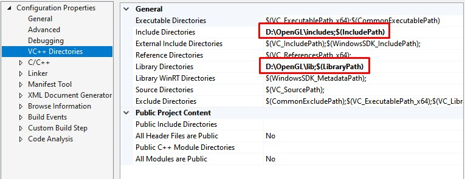
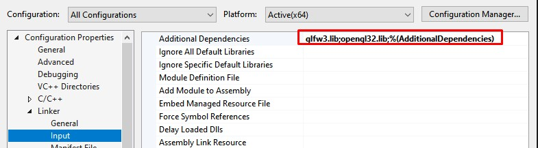

# Learn OpenGL

This repo is my personal playground for learning OpenGL.
I follow along the great learning ressources on [learnopengl.com](https://learnopengl.com/) by Joey de Vries.

## Getting Started

I created this project in Visual Studio 19 on Windows 10.
If you are also working on Windows and in Visual Studio follow these steps.

1. Add the includes folder to your visual studio's VC++ Directories -> Include Directories
2. Add the lib folder to your visual studio's VC++ Directories -> Library Directories

2. Add glfw3.lib and opengl32.lib in visual studio's Linker -> Input -> Additional Dependencies

You should be all set up now!

Note: If you are working on a different operating system, you can also get the libraries from their corresponding websites and either download the compiled lib directly or build it on your own. You can find detailed instructions on [learnopengl.com](https://learnopengl.com/).